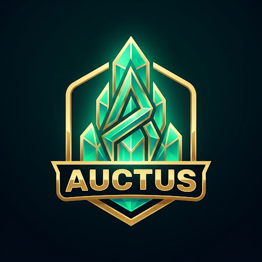

<div align="center">



# ⚔️ AUCTUS V2

### **The Tactical RPG Productivity Citadel**

*Level up your real-world productivity through a dark-fantasy RPG progression system.*

<br>


</div>

---

## 🌍 Overview

**AUCTUS V2** is a personal, local-first productivity engine disguised as an RPG. Built with modular domain engines, robust timestamp-backed timers, schema migrations, and zero external backend dependencies, AUCTUS turns your daily grind into a rewarding progression campaign.

Every task completed earns XP and gold, habits forge streak milestones, focus sprints charge your Citadel power, and time-locked loot chests reward sustained discipline.

---

## 🗺️ The 5 Citadel Realms

| Realm | Purpose & Mechanics |
|---|---|
| 🏝️ **Realm** | Central command dashboard displaying active hero stats, live chest slots, daily momentum, and quick-action shortcuts. |
| 📜 **Quests & Habits** | **Mission Forge** with categorized quests (Daily, Main, Bounties, Urgent) and a **Habit Forge** tracking consecutive streak milestones (3d, 7d, 14d, 21d, 30d). |
| ⏱️ **Focus Arena** | Timestamp-backed deep work arena with Pomodoro cycles, streak multipliers, mana overcharge, and procedural Web Audio soundscapes. |
| 💎 **Vault & Treasury** | 4-slot timed chest loot system (Bronze, Silver, Gold, Mythic) and a **Treasury Store** for redeeming custom real-world rewards with double-entry transaction ledgers. |
| 🏰 **Citadel** | Long-term prestige system spanning 5 Citadel Tiers (Genesis Outpost → Celestial Apex Citadel) with passive XP buffs, 15+ achievements, telemetry analytics, and data management. |

---

## ✨ Key Architectural Features

### 1. ⚙️ Pure Domain Engine Architecture
All game logic is cleanly extracted from React components into testable, deterministic pure TypeScript modules (`src/domain/`):
- **`progression/`**: XP calculations, level thresholds, and stat progression.
- **`quests/`**: Quest creation, priority sorting, tag filtering, and reward grants.
- **`habits/`**: Streak tracking, milestone yields, and daily check-ins.
- **`focus/`**: Wall-clock timestamp math, streak multipliers, and session yields.
- **`economy/`**: Safe balance deductions, currency conversions, and transaction logs.
- **`chests/`**: Drop deck loot rolls, timestamp unlock timers, and shard speedups.
- **`citadel/`**: 5-tier citadel ascendancy, power requirements, and title grants.
- **`achievements/`**: 15+ automated reactive achievements across all domains.
- **`analytics/`**: 0–100 discipline ratings, daily focus aggregates, and shareable debriefs.

### 2. ⏳ Timestamp-Backed Timer Resilience
All persistent timers (Focus Arena and Chest Unlocks) store wall-clock timestamps (`startedAt`, `endsAt`, `pausedAt`). Refreshing the browser, closing the tab, or backgrounding the window maintains true countdown precision.

### 3. 🛡️ Robust Local-First Persistence & Migrations
- Multi-tier `localStorage` schemas with automated V1 → V2 schema migrations.
- Complete JSON export and import capabilities with timestamped backup payloads.
- Corrupted JSON safe-fallbacks to prevent user progress loss.

### 4. 🔊 Procedural Web Audio Synthesizer
Zero external sound files. Real-time synthesized spatial audio and ambient flow soundscapes:
- **Cyber Citadel Rainstorm**
- **Deep Space Binaural 432Hz**
- **Arcane Forest Resonance**
- **Cosmic Static Shield**

### 5. ⌨️ Global Keyboard Navigation
- `1` – `5` : Instant screen switching (Realm, Quests, Focus Arena, Vault, Citadel)
- `M` : Toggle procedural sound effects and audio
- `?` : Open interactive Onboarding & Tutorial Guide
- `Esc` : Dismiss active modals and overlays

---

## 🚀 Getting Started

### Prerequisites
- **Node.js** ≥ 18.x (tested on 20.x and 22.x LTS)
- **npm** ≥ 9.x

### Installation & Development

```bash
# 1. Clone the repository
git clone https://github.com/iamakhilan/Project-Auctus.git
cd Project-Auctus

# 2. Install dependencies
npm install

# 3. Start development server
npm run dev
```

Open [http://localhost:5173](http://localhost:5173) in your browser.

---

## 📱 Android Development & Live Reload

AUCTUS runs as a native Android application powered by [Capacitor](https://capacitorjs.com). With its live-reload architecture, you can edit source code in your editor, save, and see changes update immediately on your physical Android phone without reinstalling the APK.

### 📋 Prerequisites
- **Node.js** ≥ 18.x
- **Android Studio** (Hedgehog, Iguana, Jellyfish, Ladybug or newer) with:
  - Android SDK Platform 34+
  - Android SDK Build-Tools
  - Android SDK Platform-Tools (`adb`)
- **JDK 21** (or bundled Android Studio JBR)
- **Physical Android Phone** with:
  - **Developer Options** enabled
  - **USB Debugging** enabled

---

### ⚡ 1. First-Time Setup & APK Installation

```bash
# 1. Install dependencies
npm install

# 2. Build web assets and sync native Capacitor project
npm run mobile:sync

# 3. Compile the debug APK (automatically detects Java/SDK paths)
npm run mobile:build

# 4. Install onto your connected Android phone via ADB
adb install -r android/app/build/outputs/apk/debug/app-debug.apk
```
*Alternatively, open the native project in Android Studio with `npm run mobile:open` and click **Run** (`Shift+F10`).*

---

### 🔥 2. Daily Live Reload Development (No Rebuilding Needed!)

During development, you **never** need to rebuild or reinstall the APK after every code change. Simply run:

```bash
# Option A — Wi-Fi LAN Mode (Computer and Phone on same Wi-Fi)
npm run mobile:dev

# Option B — USB Mode (Uses ADB reverse port forwarding — works offline / behind firewalls)
npm run mobile:dev:usb
```

#### The Live Development Loop:
1. Run `npm run mobile:dev` (or `npm run mobile:dev:usb`).
2. Open **AUCTUS** on your physical phone.
3. Edit any TypeScript, React, or CSS file in `src/`.
4. Hit **Save**.
5. ✨ **Your phone updates instantly via Vite HMR!**

---

### 📦 3. Production APK Packaging

When you are ready to create a standalone, self-contained Android APK that runs offline without any development server:

```bash
# Build standalone Debug APK
npm run mobile:build

# Build standalone Release APK
npm run mobile:build:release
```
The resulting APK will be placed in `android/app/build/outputs/apk/` and bundles all assets locally.

---

### 🎮 Native Android Integrations
- **App ID**: `com.akhilan.auctus`
- **Branding**: Full adaptive launcher icons & dark navy splash screen (`#081326`)
- **Android Hardware Back Button**: Closes active modals → navigates to Realm → minimizes app
- **Safe Area Insets**: Edge-to-edge support with notch & gesture bar avoidance (`env(safe-area-inset-*)`)
- **Native Notifications**: Timestamp-backed notifications via `@capacitor/local-notifications` with fallback to Web Notifications
- **Lifecycle Resilience**: Game state & focus timers derive from wall-clock timestamps on app pause/resume

---

## 🧪 Testing & Quality Assurance

AUCTUS V2 features comprehensive automated unit testing using **Vitest** and **React Testing Library**:

```bash
# Run all unit tests
npm test

# Run tests in single-run mode
npm test -- --run

# Typecheck TypeScript codebase
npx tsc --noEmit

# Production bundle build
npm run build
```

---

## 📂 Codebase Structure

```
Project-Auctus/
├── .github/workflows/ci.yml # GitHub Actions CI pipeline
├── public/assets/           # Optimized PNG artwork & icons
├── src/
│   ├── components/          # UI View Layers & Modals
│   │   ├── analytics/       # Daily Summary Debrief modal
│   │   ├── citadel/         # Citadel ascension & achievement gallery
│   │   ├── common/          # Reward claim modal & shared UI
│   │   ├── focus/           # Focus Arena timer & soundscapes
│   │   ├── layout/          # Top HUD & Bottom dock navigation
│   │   ├── onboarding/      # First-run interactive guide
│   │   ├── quests/          # Quest board & Mission Forge
│   │   ├── realm/           # Realm dashboard
│   │   └── vault/           # Chests & Treasury reward bazaar
│   ├── context/             # Global GameState orchestration
│   ├── domain/              # Pure business logic engines
│   │   ├── achievements/    # Achievement condition evaluators
│   │   ├── analytics/       # Daily telemetry & discipline ratings
│   │   ├── citadel/         # Citadel tiers & power thresholds
│   │   ├── chests/          # Loot decks & unlock calculations
│   │   ├── economy/         # Double-entry ledger & balances
│   │   ├── focus/           # Timing engine & yield multipliers
│   │   ├── habits/          # Streak engine & milestones
│   │   ├── progression/     # Level curves & XP scaling
│   │   └── quests/          # Quest creation, filters & sorting
│   ├── hooks/               # Custom React hooks & keyboard shortcuts
│   ├── services/            # Storage migrations & Web Notifications
│   │   ├── notifications/   # Local browser notification triggers
│   │   └── storage/         # Safe schema migrations, backup/restore
│   ├── types/               # Type-safe domain models & contracts
│   └── utils/               # Procedural audio engine & math helpers
├── tests/
│   └── unit/                # 14 unit test suites covering all domains
├── index.html
├── package.json
├── tailwind.config.js       # Dark navy & gold token theme
├── tsconfig.json
└── vite.config.ts
```

---

## 🛠️ Tech Stack

- **Frontend**: [React 18](https://react.dev) + [TypeScript 5](https://www.typescriptlang.org)
- **Build Tool**: [Vite 5](https://vite.dev)
- **Styling**: [Tailwind CSS 3.4](https://tailwindcss.com) (Token-based RPG Theme)
- **Testing**: [Vitest 2.1](https://vitest.dev) + [React Testing Library](https://testing-library.com) + [JSDOM](https://github.com/jsdom/jsdom)
- **Effects & SFX**: [Canvas Confetti](https://github.com/catdad/canvas-confetti) + Native Web Audio API Synthesizer

---

## 📜 License

MIT © [Akhilan](https://github.com/iamakhilan)
